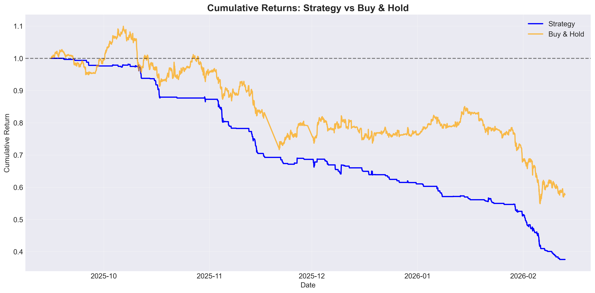
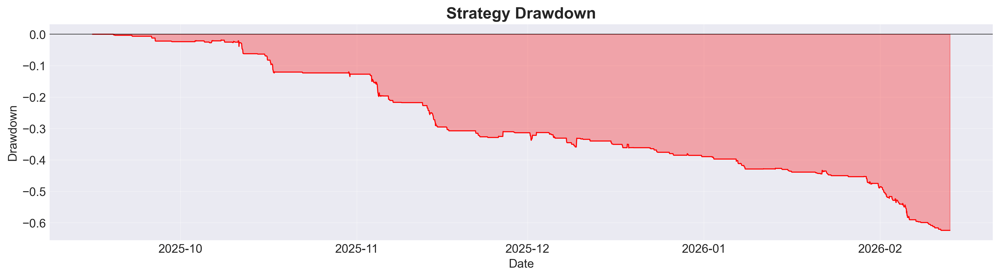
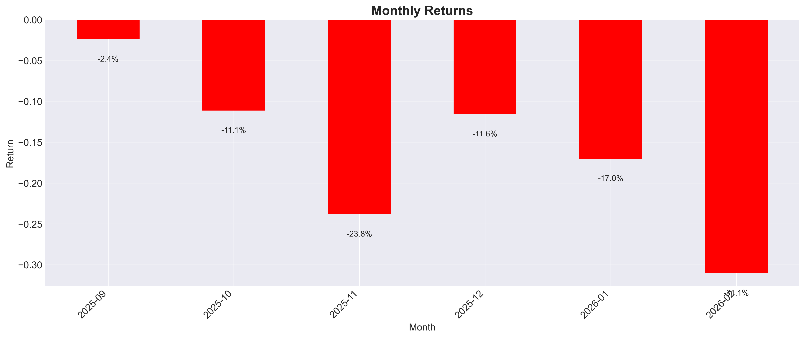
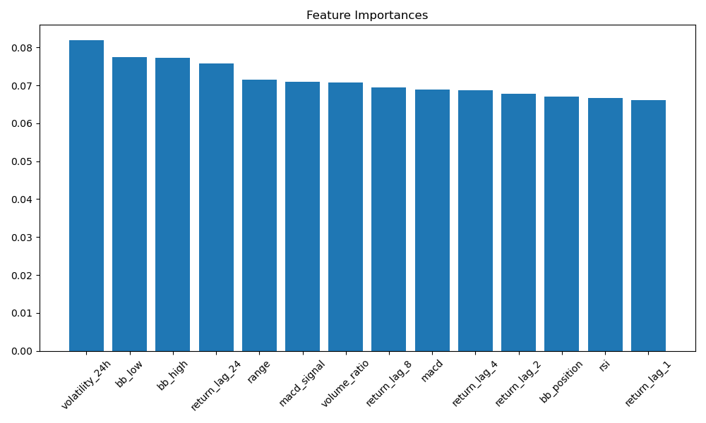

# ₿ BTC-USD Directional Prediction & Backtesting

Predicting short-horizon direction of Bitcoin (up/down over the next 4 hours) using classic ML classifiers, and evaluating whether the signal translates into a profitable trading strategy after transaction costs.

> **TL;DR:** The models beat a coin flip on classification metrics (best accuracy ≈ 64%, ROC-AUC ≈ 0.56), but the resulting trading strategy **underperforms buy & hold** once transaction costs are included (Sharpe ≈ -2.58). This is a common and instructive result — see [Results](#-results) and [Key Takeaways](#-key-takeaways) below.

---

## 📌 Problem Statement

Can we predict whether BTC-USD will go up or down over a short horizon (H = 4 hours) using technical indicators computed from historical OHLCV data, and can that prediction be turned into a profitable trading strategy?

## 🗂️ Project Structure

```
btc_prediction_RF/
├── 01_data_preparation.ipynb      # Download & clean raw OHLCV data
├── 02_feature_engineering.ipynb   # Technical indicators + target labeling
├── 03_model_training.ipynb        # Train & evaluate ML models
├── 04_backtesting.ipynb           # Signal generation, strategy backtest
├── src/
│   ├── config.py                  # Central config (paths, params, features)
│   └── utils.py                   # Data loading, cleaning, target creation
├── data/
│   ├── raw/                       # Raw yfinance export (gitignored)
│   └── processed/                 # Cleaned & feature-engineered data (gitignored)
├── models/                        # Saved trained models (.pkl)
├── reports/
│   ├── figures/                   # Backtest & EDA plots
│   └── metrics/                   # Model comparison results (results.csv)
├── requirements.txt
└── README.md
```

## 📊 Data

- **Source:** [Yahoo Finance](https://finance.yahoo.com/) via the [`yfinance`](https://pypi.org/project/yfinance/) Python library
- **Asset:** BTC-USD
- **Frequency:** 1-hour candles
- **Period:** ~Feb 2024 → Feb 2026 (2 years)
- **Fields:** Open, High, Low, Close, Volume

Raw and processed data files are **not versioned** in this repo (see `.gitignore`) to keep it lightweight. Re-run `01_data_preparation.ipynb` to regenerate them from Yahoo Finance.

## 🎯 Target Definition

```python
return_future = Close.pct_change(horizon).shift(-horizon)
target = 1 if return_future > threshold else 0
```

- **Horizon (H):** 4 hours
- **Threshold:** 0.2% (filters out noise / near-zero moves rather than a strict `> 0`)

## 🧮 Features

| Category | Features |
|---|---|
| Lagged returns | `return_lag_1`, `return_lag_2`, `return_lag_4`, `return_lag_8`, `return_lag_24` |
| Volatility | `volatility_24h` (rolling std of returns) |
| Momentum | `rsi`, `macd`, `macd_signal` |
| Bands | `bb_high`, `bb_low`, `bb_position` (Bollinger) |
| Volume / Range | `volume_ratio`, `range` (High − Low) |

Computed with the [`ta`](https://pypi.org/project/ta/) technical analysis library.

## 🤖 Models

| Model | Library |
|---|---|
| Logistic Regression (baseline) | `scikit-learn` |
| Random Forest | `scikit-learn` |
| XGBoost | `xgboost` |

**Validation:** chronological (time-based) train/test split — no shuffling, no lookahead leakage. `TEST_SIZE = 20%`.

## 📈 Results

### Classification metrics (test set)

| Model | Accuracy | Precision | Recall | ROC-AUC |
|---|---|---|---|---|
| **Logistic Regression** | **0.643** | 0.474 | 0.081 | **0.560** |
| Random Forest | 0.615 | 0.410 | 0.204 | 0.537 |
| XGBoost | 0.568 | 0.362 | 0.292 | 0.509 |

*Logistic Regression edges out the more complex models on both accuracy and ROC-AUC — a reminder that added model complexity doesn't guarantee better generalization on noisy financial data.*

### Strategy backtest (Random Forest, threshold = 0.55, 0.1% cost/trade)

| Metric | Value |
|---|---|
| Final Cumulative Return | **-62.42%** |
| Buy & Hold Return | -42.21% |
| Outperformance vs. Buy & Hold | -20.21% |
| Sharpe Ratio | -2.58 |
| Max Drawdown | -62.42% |
| Hit Ratio | 31.97% |
| Number of Trades | 294 |
| Profit Factor | 0.45 |

<p align="center">
  
  
</p>
<p align="center">
  
  
</p>

## 🔍 Key Takeaways

- **Classification ≠ profitability.** Even a model with >60% accuracy can produce a losing strategy once transaction costs, trade frequency, and asymmetric win/loss sizes are accounted for.
- The strategy's **hit ratio (32%) is far below its win rate needed for breakeven**, given average loss (-0.55%) slightly exceeds average win (+0.52%) and costs eat into every round-trip trade.
- **Simplest model won on ROC-AUC.** Logistic Regression outperforming Random Forest/XGBoost suggests the signal-to-noise ratio in these features is low relative to model capacity — a sign of overfitting risk in the tree-based models.
- This is a **known and well-documented challenge** in short-horizon crypto price prediction: technical indicators alone rarely provide a stable, tradable edge on liquid assets like BTC.

## 🚀 Possible Improvements

- Walk-forward / rolling-window validation instead of a single chronological split
- Class rebalancing or cost-sensitive learning (target is imbalanced: ~62/38)
- Position sizing & stop-loss rules instead of binary long/flat
- Additional features: order-book imbalance, on-chain metrics, funding rates, cross-asset signals
- Hyperparameter tuning (Optuna/GridSearchCV) with purged time-series cross-validation
- Ensemble / stacking of the three models

## 🛠️ How to Reproduce

```bash
# 1. Clone the repo
git clone https://github.com/<your-username>/btc_prediction_RF.git
cd btc_prediction_RF

# 2. Create a virtual environment
python -m venv venv
source venv/bin/activate      # Windows: venv\Scripts\activate

# 3. Install dependencies
pip install -r requirements.txt

# 4. Run the notebooks in order
jupyter notebook
# 01_data_preparation.ipynb → 02_feature_engineering.ipynb
# → 03_model_training.ipynb → 04_backtesting.ipynb
```

## 🧰 Tech Stack

`Python` · `pandas` · `numpy` · `scikit-learn` · `xgboost` · `ta` · `yfinance` · `matplotlib` · `seaborn` · `Jupyter`

## ⚠️ Disclaimer

This project is for **educational purposes only**. Nothing here constitutes financial advice. Past performance (and backtested performance especially) is not indicative of future results.

## 📄 License

[MIT](LICENSE)

## 👤 Author

**CHAYMAE HANINI** — [LinkedIn](#) · [GitHub](#)
